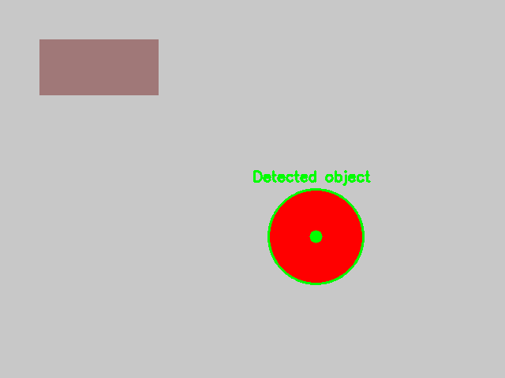

# vision_object_tracking

Simple ROS package that performs color-based object tracking using OpenCV and controls a differential-drive robot toward the detected object.

## Build

This package targets ROS (catkin). From your workspace root:

```bash
# install dependencies (if needed)
rosdep install --from-paths src --ignore-src -r -y

# build (catkin)
catkin_make
# or (for ROS2/colcon) adapt accordingly
```

Don't forget to source your workspace:

```bash
source devel/setup.bash
```

## Environment setup & prerequisites 🛠️

Follow these steps to prepare a system (example uses **ROS Noetic** on Ubuntu):

1. Install ROS (see official docs for other distros). Example:

```bash
sudo apt update
sudo apt install -y ros-noetic-desktop-full
```

2. Initialize and update rosdep, and install some system packages used by this project:

```bash
sudo apt install -y python3-rosdep python3-catkin-tools
sudo rosdep init || true
rosdep update
sudo apt install -y ros-noetic-image-transport ros-noetic-cv-bridge \
	ros-noetic-dynamic-reconfigure ros-noetic-rqt-reconfigure ros-noetic-gazebo-ros
```

3. Create or use a catkin workspace and place this package under `src/`:

```bash
mkdir -p ~/catkin_ws/src
cd ~/catkin_ws/src
# clone this repo or copy the package into src/
git clone <repo-url>  # or copy files here
cd ~/catkin_ws
rosdep install --from-paths src --ignore-src -r -y
catkin_make
source devel/setup.bash
```

4. Optional: If you rely on Gazebo models or plugins, ensure your Gazebo install matches your ROS distro and that `GAZEBO_MODEL_PATH`/`GAZEBO_PLUGIN_PATH` are set (usually handled by the ROS/Gazebo packages above).

5. Install `rqt_reconfigure` to tune parameters at runtime:

```bash
sudo apt install -y ros-noetic-rqt-reconfigure
```

### Run examples (from workspace root)

- Launch full simulation (Gazebo + robot + nodes):

```bash
roslaunch vision_object_tracking simulation.launch
```

- Launch just vision + controller (with config file params):

```bash
roslaunch vision_object_tracking vision_tracking.launch
```

- Override a parameter from the command line:

```bash
roslaunch vision_object_tracking vision_tracking.launch visualize:=false
```

- Run nodes directly (useful for debugging):

```bash
# start vision node with overrides
rosrun vision_object_tracking vision_node _image_topic:=/camera/image_raw _visualize:=true

# start controller node
rosrun vision_object_tracking controller_node _object_topic:=/object_position
```

### Headless systems / CI

On headless machines or CI, disable GUI windows (no X required):

```bash
roslaunch vision_object_tracking vision_tracking.launch visualize:=false
```

### Troubleshooting

- If `dynamic_reconfigure` headers are missing, ensure `ros-noetic-dynamic-reconfigure` is installed and re-run `catkin_make` so generated headers are available.
- If Gazebo camera topics are not publishing, verify Gazebo is running and the plugin in `urdf/robot.urdf` matches installed gazebo ROS packages.
- If `rosrun rqt_reconfigure rqt_reconfigure` fails, ensure you have a GUI available or use an X-forwarded session.

## Simulating moving objects and a person

You can spawn a moving colored object (red sphere) and a simple person-like cylinder into the Gazebo world and have them move along simple trajectories.

Run the actors launch which includes the full simulation and spawns/moves models:

```bash
roslaunch vision_object_tracking actors.launch
```

The spawner script is `scripts/spawn_and_move.py` and supports parameters (see launch file) such as `path_radius`, `path_speed`, and `person_speed`.

If you want to capture real screenshots from the running simulation, run the launch and use your system screenshot tool or `rosrun image_view image_saver` to save camera topics images:

```bash
rosrun image_view image_saver image:=/camera/image_raw _filename_format:="/tmp/cam%04d.png"
```

This helps verify that the vision node detects the red object and that the controller responds to the person or object movements.

## Run in simulation

Start Gazebo with the provided world and robot, plus the vision and controller nodes:

```bash
roslaunch vision_object_tracking simulation.launch
```

You can tune parameters (HSV thresholds, visualization, topics) in `vision_tracking.launch` or via the parameter server. Defaults:

- image_topic: `/camera/image_raw`
- output_topic: `/object_position` (publishes `geometry_msgs/PointStamped`)
- visualize: `true` (shows OpenCV window)
- HSV thresholds: `h_min=0, s_min=120, v_min=70, h_max=10, s_max=255, v_max=255`

Controller params (set in `vision_tracking.launch` or via rosparam):

- `image_width`, `image_height` — used to compute the image center
- `kp_angular`, `kp_linear` — proportional gains for control

## Usage examples & parameter files ✅

You can edit the shipped params at `config/vision_params.yaml` and launch with:

```bash
roslaunch vision_object_tracking vision_tracking.launch
```

To override a single param on the command line:

```bash
roslaunch vision_object_tracking vision_tracking.launch visualize:=false
```

# Dynamic reconfigure (tune at runtime)

The package supports `dynamic_reconfigure`. Start the nodes and run:

```bash
rosrun rqt_reconfigure rqt_reconfigure
```

Then select `/vision_node` and adjust HSV thresholds, `area_threshold`, and `visualize` in real time.

## CI, badges & contribution

The repository includes a GitHub Actions workflow (`.github/workflows/ros-ci.yml`) that builds the package on pushes and PRs.

[](https://github.com/alouii/vision-object-tracking-ros/actions/workflows/ros-ci.yml)

### Contributing

- Fork the repository and open a PR with a clear description of the change.
- Run `rosdep install --from-paths src --ignore-src -r -y` and `catkin_make` locally before submitting.
- Prefer small, easily reviewable changes and include tests / demos where practical.

## Notes & Suggestions

- Tweak HSV thresholds to match your target color under different lighting.
- If using headless systems, set `visualize=false` to avoid GUI issues.
- Consider adding diagnostic topics (e.g., mask, debug images) and a parameter to publish mask images for offline debugging.

## Screenshots 📷

Example output (generated sample images are included in `docs/screenshots`):



_Tracking view: detected object is shown with a green marker and circle._


_Mask view: binary mask for the detected color (useful for tuning HSV thresholds)._ 


